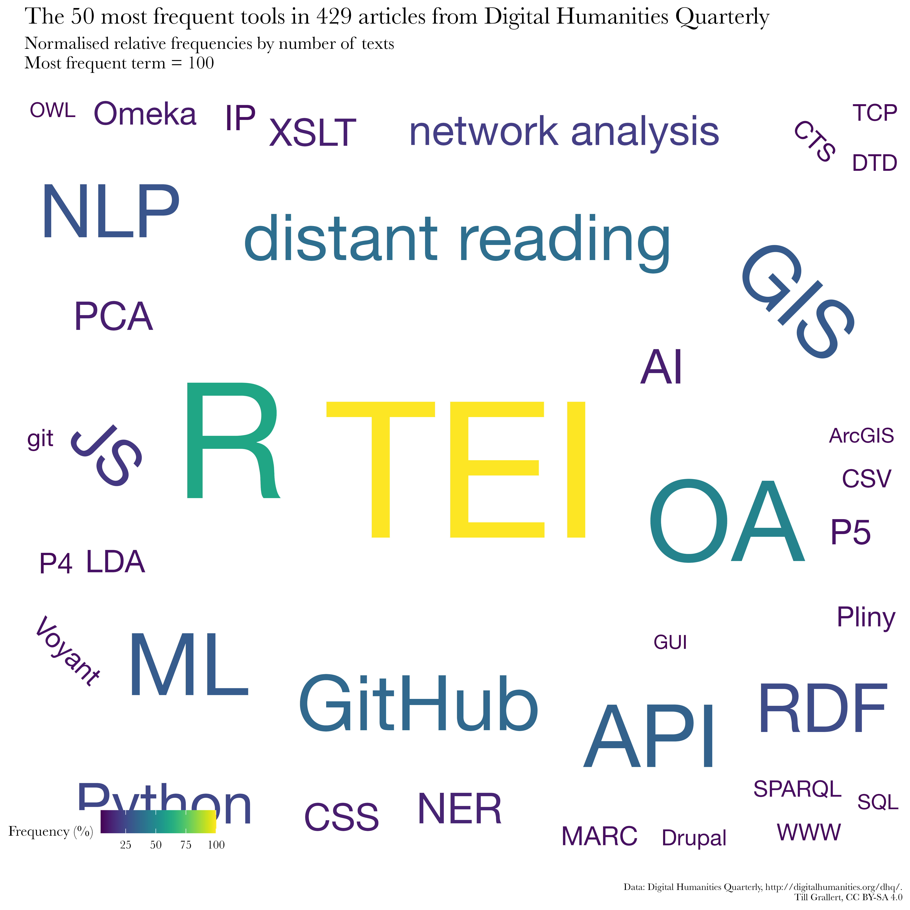

This [R Markdown](http://rmarkdown.rstudio.com) Notebook presents our approach to answering the following the question:

>We are a *[Scholarly Makerspace](https://makerspace.hypotheses.org)* and want to curate a **list of tools** for DH work based on their **importance** in the **field**.

The question contains a number of terms (highlighted above) that need further elaboration, if we want to operationalise the question for computational (or any) analysis:

- The **field** of DH is represented by its written output, through conference abstracts, journal articles etc. This means that we need to find or build a **corpus** of openly available material to run any analysis on.
- There are, of course, multiple approaches to measuring the relative **importance** of anything. For the sake of our analysis, we will opt for the number of mentions of a specific tool within a corpus as a measure of its importance to the field.
- As we do not, currently, have a sophisticated way of extracting tools through *natural language processing* (NLP), we will need to find or produce a **list of tools** known to be relevant to the field. As tool registries have some importance in DH, we assume to be able to compile such a list with relative ease. Each entry in the list will then be assigned numerical values correlating to their relative frequency within our corpus.

Even though our approach was developped independently in spring 2022, it appeared that other scholars were posing similar questions, following comparable approaches. Thus, we have benefitted from Ulrike Henny-Kramer [@HennyJettka2021SoftwarezitationPaper] and Frank Fischer's earlier work [@BarbotEtAl2019ToolsMentioned; @BarbotEtAl2019WhichDHTools; @FischerMoranville2020ToolsMentioned]. We also look foward to the results of Manuel Burghardt's ventures into the more general question of scholarly applications of methods and tools, which he and his team investigate with machine-learning approaches to natural language processing [@Cebral2022InteractiveExploratoryAnalysis; @GutierrezDeLaTorreEtAl2022ManyFacesTheory; @ManuelEtAl2022ToolsEpistemologiesDH]. 

# Prepare the environment

As is good practice, we load all necessary packages/libraries at the beginning of our R script. We also make sure that everything is set to use unicode encodings (might be necessary for some Apple systems).

```{r prepare environment,  results="hide"}
# load libraries
library(tidyverse)   # load the core of the tidyverse packages, including ggplot
library(ggrepel)     # repel labels in ggplot
library(ggwordcloud) # wordclouds with ggplot
library(paletteer)   # for better colour palettes
library(here)        # for easy navigation within an R project
library(lubridate)   # for working with dates
# set a general theme for all ggplots
theme_set(theme_bw())
# enable unicode
Sys.setlocale("LC_ALL", "en_US.UTF-8")
```


# corpus building
## Corpora

We use a number of openly available corpora for our investigation. 

1. **DH conferences**. Full-text abstracts for some of ADHO's DH conferences are available as part of [LincolnEtAl2021IndexDigitalHumanities; @Weingart2020IndexDHData]. The abstracts for the DH2023 conference in Tokyo are available on [GitHub](https://github.com/747/tei-to-pdf-dh2022).
2. **DHd conferences**. Abstracts for the annual DHd conferences is available from the [DHd GitHub](https://github.com/DHd-Verband) repositories.
3. **Digital Humanities Quarterly**. Articles from DHQ are openly published with CC licences and are generally available for computational analysis. A corpus of 429 articles published until 2019 is available as zipped folder at <http://digitalhumanities.org/dhq/data/dhq-xml.zip>.
4. **DFG**. The [GEPRIS - Geförderte Projekte der Deutschen Forschungsgemeinschaft](https://gepris.dfg.de/gepris/OCTOPUS) database provides data on all funded projects. Unfortunately, and despite its commitment to Open Access and Open Science, DFG does not provide an API or machine-actionable data for reuse. 

## Preprocessing

For our analysis we need plain-text files of conference abstracts and journal articles. The pre-processing steps for our copora, therefore, involve two distinct approaches: 1) converting TEI XML to plain-text and 2) scraping structured data from websites, which we save as `.csv`.

### TEI XML

ADHO, DHd, and DHQ all provide TEI XML files, which we can convert to plain-text using XSLT transformations, such as the one provided by my [GitHub repository to convert TEI to Markdown](https://github.com/OpenArabicPE/convert_tei-to-markdown). Note that one could have parsed the XML with R and then extracted the necessary nodes for analysis, but re-using available XSLT was the much quicker solution.


```xml
<?xml version="1.0" encoding="UTF-8"?>
<TEI xmlns="http://www.tei-c.org/ns/1.0">
    <teiHeader>
        <fileDesc>
            <titleStmt>
                <title>Establishing parameters for stylometric authorship attribution of 19th-century Arabic books and periodicals</title>
                <author>
                    <persName>
                        <surname>Romanov</surname>
                        <forename>Maxim</forename>
                    </persName>
                    <affiliation>Universität Hamburg, Germany</affiliation>
                </author>
                <author>
                    <persName>
                        <surname>Grallert</surname>
                        <forename>Till</forename>
                    </persName>
                    <affiliation>Humboldt-Universität zu Berlin, Germany</affiliation>
                </author>
            </titleStmt>
            <editionStmt>
                <edition>
                    <date>2022-04-27T10:36:00Z</date>
                </edition>
            </editionStmt>
        </fileDesc>
        <!-- ... -->
    </teiHeader>
    <text>
        <body>
            <p style="text-align: left; ">The vast majority of articles in Arabic periodicals from the late Ottoman Eastern Mediterranean (c.1850–1918) carried no explicit authorship information (Grallert 2021, Khayat 2019). Yet, the question of authorship has not received much attention in existing scholarship and is strikingly absent from Ayalon (1995), the standard work in the field. The common implicit hypothesis considers editors-cum-owners listed in mastheads and imprints as the sole authors of all the anonymous texts. This results in the conflation of periodicals with the intellectual output of a single person. Such a synonymous use of, for example, “Muḥammad Kurd ʿAlī” (1876–1953) and the monthly “<hi rend="italic">al-Muqtabas</hi>” (published in Cairo and Damascus, 1906–1918) can be observed across the board (e.g. Seikaly 1981, Ezzerelli 2017). However, the hypothesis a) remains empirically untested, b) negates the known realities of periodical production and individual biographies, and c) ignores specific contexts of individual periodicals.
            </p>
            <!-- ... -->
        </body>
    </text>
</TEI>
```

```txt
The vast majority of articles in Arabic periodicals from the late Ottoman Eastern Mediterranean (c.1850–1918) carried no explicit authorship information (Grallert 2021, Khayat 2019). Yet, the question of authorship has not received much attention in existing scholarship and is strikingly absent from Ayalon (1995), the standard work in the field. The common implicit hypothesis considers editors-cum-owners listed in mastheads and imprints as the sole authors of all the anonymous texts. This results in the conflation of periodicals with the intellectual output of a single person. Such a synonymous use of, for example, “Muḥammad Kurd ʿAlī” (1876–1953) and the monthly “ al-Muqtabas ” (published in Cairo and Damascus, 1906–1918) can be observed across the board (e.g. Seikaly 1981, Ezzerelli 2017). However, the hypothesis a) remains empirically untested, b) negates the known realities of periodical production and individual biographies, and c) ignores specific contexts of individual periodicals. 
```

It would also make sense to extract structured metadata from the TEI files but this step has been left to a later step. 

#### DH conferences

One thing to note, however, is that the TEI XML of the ADHO abstracts from the [LincolnEtAl2021IndexDigitalHumanities; @Weingart2020IndexDHData] dataset is wrapped inside `.csv` files. In addition, some of the abstracts are TEI XML fragments while others are complete TEI XML files. We have, therefore, extracted the abstracts with the following code.

```{r}
# 1. read the original CSV
setwd(here("data/dh-conferences/12987959"))
df.dhconfs <- readr::read_csv("dh-conferences_works.csv")

# 2. select only some columns and rename them
df.dhconfs.works <- df.dhconfs %>%
  dplyr::select(work_id, work_title, work_authors, full_text, conference_year, conference_label, conference_organizers, keywords, topics, languages) %>%
  dplyr::rename(id = work_id,
                title = work_title,
                text = full_text,
                authors = work_authors,
                year = conference_year,
                conference = conference_label,
                organizers = conference_organizers) %>%
  dplyr::mutate(year = parse_date_time(year, orders = "Y"),
                id = as.character(df.dhconfs.works$id))
```

The dataset contains `nrow(df.dhconfs.works)` presentations at `unique(df.dhconfs.works$conference)` between `min(df.dhconfs.works$year)` and `max(df.dhconfs.works$year)`.

```{r}
# save data to file
setwd(here("data/dh-conferences/"))
save(df.dhconfs.works, file = "dh-conferences_works.rda")
save(df.dhconfs, file ="dh-conferences.rda")
# remove the original, rather large dataframe
rm(df.dhconfs)

# there is a problem with the abstracts: they are mostly full TEI XML files, which need to be parsed
# small tibble with abstracts only
df.dhconfs.abstracts <- df.dhconfs.works %>%
  dplyr::select(id, text, year) %>%
  # drop all lines that do not provide the full text of the abstract
  tidyr::drop_na(text)
``` 

The dataset provides only `nrow(df.dhconfs.abstracts)` full text abstracts for the `nrow(df.dhconfs.works)` presentations
We can now save these abstracts in order to process them further with XSLT etc.

Note that running the next code block results in files being overwritten. 

```r
# write each abstract to a file for further processing with XSLT
setwd(here("data/dh-conferences/12987959/tei/"))
lapply(seq_len(nrow(df.dhconfs.abstracts)), function(i) 
  write.table(df.dhconfs.abstracts$text[i], file = paste0(df.dhconfs.abstracts$id[i], '.xml'), 
            row.names = FALSE, col.names = F, quote=FALSE))
```

Upon closer inspection, it turns out that not all abstracts are complete TEI XML files. There are hundreds of TEI XML fragments and quite a few plain-text files without any markup. 

1. The plain-text files were renamed to `.txt`
2. Complete TEI XML files were converted to plain-text using the above-mentioned XSLT.
2. TEI XML fragments were converted to full TEI XML files adding the necessary `<teiHeader>` using regular expressions. The complete TEI files were then again converted to plain-text.


## load tool list

```{r, results="hide"}
df.tools <- read_csv(here("data","tools.csv")) %>%
  dplyr::filter(term != 'Internet') # it makes sense to remove this term from the tool list as it heavily skews the resulting frequencies
```

## load copora

Now we want to load all the pre-processed plain-text files. To re-use this code, we have wrapped it in functions.

```{r}
# build data frame from  list of file names
f.read.txt.files <- function(filenames) {
  df.output <- purrr::map_df(filenames, ~ tibble(
    text = readr::read_file(.x)) %>%
      dplyr::mutate(filename = basename(.x))
  )
  df.output %>%
    dplyr::mutate(id = stringr::str_replace(filename, '^(.+)\\.txt', '\\1'))
}

f.read.txt.files.from.folder <- function(path) {
  v.filenames <- list.files(path = path, pattern = "*.txt",  ignore.case = T, full.names = T)
  f.read.txt.files(v.filenames)
}
```

### 1. DH conferences

```{r load-dh-conferences, results="hide"}
df.dhconfs.abstracts <- f.read.txt.files.from.folder(here("data/dh-conferences/12987959/txt")) 
# Quick look at the available variables
df.dhconfs.abstracts %>% 
  glimpse(width = 80) # width is measured in characters
```

### 2. DHd

### 3. DHQ articles

```{r load-dhq, results="hide"}
df.dhq <- f.read.txt.files.from.folder("data/dhq/txt")
# Quick look at the available variables
df.dhq %>% 
  glimpse(width = 80) # width is measured in characters
```

# analysis

To re-use this code, we have wrapped it in functions that usually take a dataframe/tibble as input. Note that the input tibble must contain a column named "text". Note also that we prefixed functions with a namespace identifying the package they come from.

## functions
### frequency count

The core of our analysis is a relatively blunt string match. We iterate over every term in our tool list, search all texts in our corpus for matches, and count the number of texts that return at least one hit. This aggregation by text acts as a weight against inflation of frequencies, if a specific tool is mentioned repeatedly throughout a given text.

```{r}
f.stringmatch.frequency <- function(df.input, list.strings) {
  df.output <- df.input %>%
    dplyr::mutate(
      term = stringr::str_extract_all(text, 
         regex(paste0("\\b", list.strings, "\\b", collapse = '|'),
               ignore_case = FALSE)) # it might make sense to add an input variable for this choice
    ) %>%
    tidyr::unnest(term) %>%
    # step 1: group by text and term: get frequency of number of hits per term per text
    dplyr::group_by(text, term) %>%
    dplyr::summarise(freq = n()) %>%
    # step 2: group by term: get frequency of number of texts per term
    dplyr::group_by(term) %>%
    dplyr::summarise(freq = n()) %>%
    # sort by frequency
    dplyr::arrange(desc(freq))
  df.output
}
```

### clean spelling variants

Our tool list contains spelling variants such as acronyms and their expansions, for which we want to aggregate the resulting frequencies.

```{r}
# note that the input needs columns named "term" and "freq"
# control for correct case of matches
# match all the variants and then group by term
f.clean.variants <- function(df.input, df.tools) {
  df.grouped <- dplyr::left_join(df.tools, df.input, by = c("variant" = "term")) %>%
    tidyr::drop_na()%>%
    dplyr::group_by(term) %>%
    dplyr::summarise(freq = sum(freq))
  df.grouped
}
```

### calculate relative frequencies

In order to compare corpora, we are interested in relative frequencies. We compute two such relative frequencies

1. Ratio of frequencies with the highest frequency set to 1. We also provide this relative frequency for a basis of 100 (i.e. as percentage)
2. Ratio of frequencies to the number of texts in our corpus with a basis of 100 (i.e. percentage)

```{r}
# note that the input needs a column named "freq"
f.relative.frequencies <- function(df.input, number.of.texts) {
  df.normalised <- df.input %>%
    # normalise frequencies: 
    dplyr::mutate(
    # 1. relative to each other
      freq.rel = freq / max(df.input$freq),
      freq.rel.100 = freq.rel * 100,
    # 2. as percentage of total number of input texts
      freq.text.100 = freq / number.of.texts * 100) %>%
    dplyr::arrange(desc(freq))
  df.normalised
}
```

### combine all functions

```{r}
f.compute.frequencies <- function(df.input, df.tools){
  df.output <- f.stringmatch.frequency(df.input, df.tools$variant) %>%
    f.clean.variants(df.tools) %>%
    f.relative.frequencies(nrow(df.input))
  df.output
}
```

## Analyse our corpora

The actual analysis is done by running all three functions in succession on any of our corpora. Note that this might take a while for large corpora.

```{r}
df.dhconfs.abstracts.tools <- f.compute.frequencies(df.dhconfs.abstracts, df.tools)
```
```{r}
df.dhq.tools <- f.compute.frequencies(df.dhq, df.tools)
```

Let's again have a brief look at the results

```{r}
head(df.dhconfs.abstracts.tools, 10)
```
```{r}
head(df.dhq.tools, 10)
```

## Visualise the results

A popular albeit controversial method to visualise such frequencies is a word cloud and as always there are multiple ways for doing so in R. For aesthetically more pleasing results, we use the popular ggplot2 library, which operationalises "A Grammar for Graphics".

The following function does multiple things 

- it takes a data frame with a frequency list as input
- slices the x most frequent terms based on an input parameter x
- builds two visualisations each based on the different relativ frequencies
  - circular wordcloud
  - a more "cloudy" approximation of a word cloud
- adds labels, etc. based on the input
- saves the plots in a specified output format (png or svg) to file


```{r}
# Wordcloud with ggplot2
# the input requires a column named "term"
f.wordcloud.frequency <- function(input, max.values, label.text, output.device) {
  # process data: frequency list
  data.frequency <- input %>%
    #dplyr::filter(freq > 1) %>% # remove unique terms: this needs to be commented out for relative frequencies
    slice(1:max.values) %>% # limit the length of the data set
    # add some 90 degree angles to 20 % of all terms
    dplyr::mutate(angle = 90 * sample(c(0, 1), n(), replace = TRUE, prob = c(80, 20))) #%>%
    # add some 45 degree angles: can be removed, I suppose
    #dplyr::mutate(angle = 45 * sample(-2:2, n(), replace = TRUE, prob = c(1, 1, 4, 1, 1)))
  # labels, captions, other variables
  v.output.device = output.device
  v.total.values = nrow(data.frequency)
  font = "Baskerville"
  v.title = paste("The", v.total.values, "most frequent", label.text, sep = " ")
  v.caption = paste(v.label.source, ".\n", v.label.license, sep = "")
  # plot: use normalised relative frequencies
  plot.base <- ggplot(data.frequency, aes(x = 1, y = 1, label = term)) +
    scale_y_continuous(breaks = NULL) +
    scale_x_continuous(breaks = NULL)
  # labs
  layer.labs <- labs(x = "", y = "", 
      title = v.title,
      caption = v.caption)
  layer.labs.rel.100 <- labs(subtitle = 'Normalised relative frequencies by number of texts \nMost frequent term = 100')
  layer.labs.text.100 <- labs(subtitle = 'Normalised relative frequencies by number of texts \nNumber of texts = 100')
  layer.repel.text.100 <- c(
    geom_text_repel(aes(size = freq.text.100, colour = freq.text.100),
        segment.size = 0, force = 20, max.overlaps = 500, family = font.words),
    scale_size(range = c(1.5, 30), guide = FALSE))
  layer.wordcloud.text.100 <- c(
    geom_text_wordcloud(aes(size = freq.text.100, colour = freq.text.100, angle = angle), # use the angle information
                        family = font.words,
                        # frequency = area or font size. If font.size, readers will get the wrong impression
                        area_corr = TRUE, 
                        eccentricity = 1, # to form a circle
                        rm_outside = TRUE, # if there are too many terms, the smallest ones should be removed if they cannot fit onto the canvas
                        grid_margin = 0.5, seed = 43,
                        show.legend = T),
    scale_size_area(max_size = 50) #, scale_radius(range = c(0, 30), limits = c(0, NA))
  )
  layer.repel.rel.100 <- c(
    geom_text_repel(aes(size = freq.rel.100, colour = freq.rel.100),
        segment.size = 0, force = 20, max.overlaps = 500, family = font.words),
    scale_size(range = c(1.5, 30), guide = FALSE))
  layer.wordcloud.rel.100 <- c(
    geom_text_wordcloud(aes(size = freq.rel.100, colour = freq.rel.100, angle = angle), # use the angle information
                        family = font.words,
                        area_corr = TRUE, 
                        eccentricity = 1, # to form a circle
                        rm_outside = TRUE, # if there are too many terms, the smallest ones should be removed if they cannot fit onto the canvas
                        grid_margin = 0.5, seed = 43,
                        show.legend = T),
    scale_size_area(max_size = 50) #, scale_radius(range = c(0, 30), limits = c(0, NA))
  )
  
  plot.base.final <- plot.base +
    layer.labs +
    scale_colour_paletteer_c("viridis::viridis") +
    guides(color = guide_colorbar("Frequency (%)", order = 1),
           size = "none")+ #guide_legend("Frequency", order = 2)) +
    theme(
      text = element_text(family = font, face = "plain"),
      plot.title = element_text(size = size.Title.Px),
      plot.subtitle = element_text(size = size.Subtitle.Px),
      plot.caption = element_text(size = size.Text.Px),
      #legend.position = c(0.84,0.01),
      #legend.position = c(0.84,1),
      legend.position = c(0.1,0.01),
      legend.justification = "bottom",
      legend.direction = "horizontal",
      legend.key = element_rect(fill = NULL),
      legend.margin = margin(0),
      panel.border = element_blank()) 
  plot.repel.text.100 <- plot.base.final +
    layer.labs.text.100 +
    layer.repel.text.100
  plot.wordcloud.text.100 <- plot.base.final +
    layer.labs.text.100 +
    layer.wordcloud.text.100
  plot.repel.rel.100 <- plot.base.final +
    layer.labs.rel.100 +
    layer.repel.rel.100
  plot.wordcloud.rel.100 <- plot.base.final +
    layer.labs.rel.100 +
    layer.wordcloud.rel.100
  # print output to console
  # plot.repel.text.100
  # save output to file
  ggsave(plot = plot.wordcloud.text.100, filename = paste("wordcloud-text-100_", label.text, "-w_", v.total.values,".", v.output.device, sep = ""),
         path = here("visualization"), device = v.output.device, units = "mm" , height = height.Plot, width = width.Plot, dpi = dpi.Plot)
  ggsave(plot = plot.repel.text.100, filename = paste("wordcloud-text-100-repel_", label.text, "-w_", v.total.values,".", v.output.device, sep = ""),
         path = here("visualization"), device = v.output.device, units = "mm" , height = height.Plot, width = width.Plot, dpi = dpi.Plot)
  ggsave(plot = plot.wordcloud.rel.100, filename = paste("wordcloud-rel-100_", label.text, "-w_", v.total.values,".", v.output.device, sep = ""),
         path = here("visualization"), device = v.output.device, units = "mm" , height = height.Plot, width = width.Plot, dpi = dpi.Plot)
  ggsave(plot = plot.repel.rel.100, filename = paste("wordcloud-rel-100-repel_", label.text, "-w_", v.total.values,".", v.output.device, sep = ""),
         path = here("visualization"), device = v.output.device, units = "mm" , height = height.Plot, width = width.Plot, dpi = dpi.Plot)
}
```

We can now apply this visualisation to our data and plot the 50 most frequent tools like so:

```{r}
f.wordcloud.frequency(df.dhq.tools, 50, paste("tools in", nrow(df.dhq),  "articles from Digital Humanities Quarterly"), "png")
```

